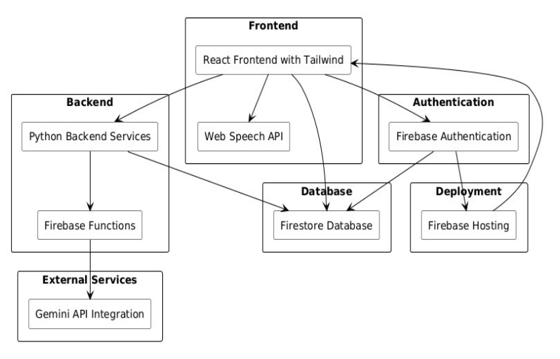
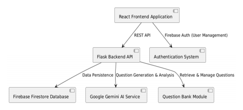
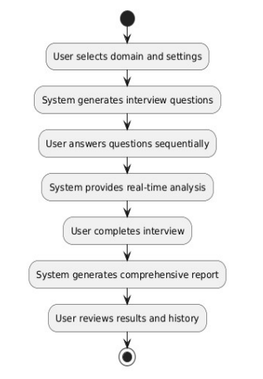
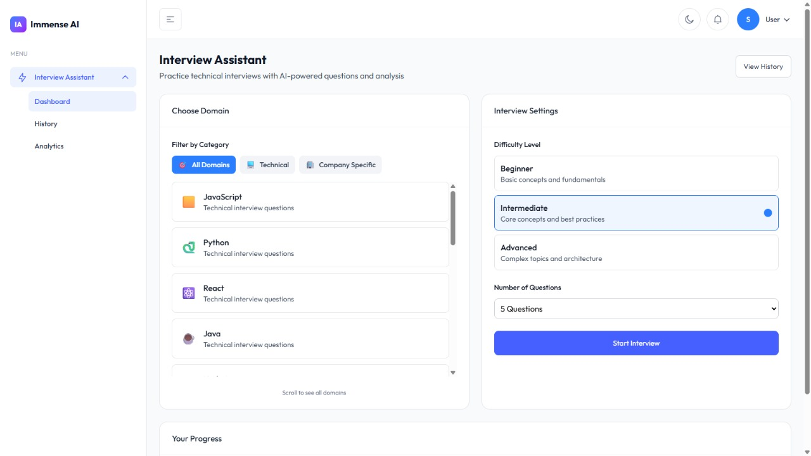
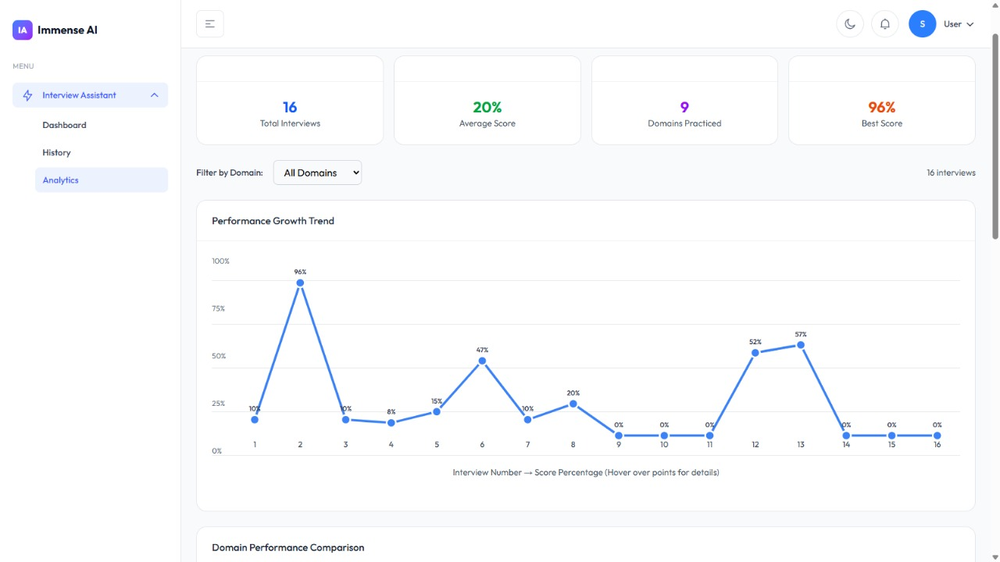
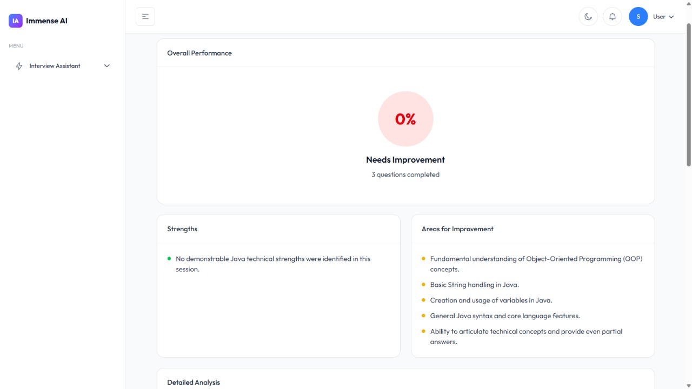
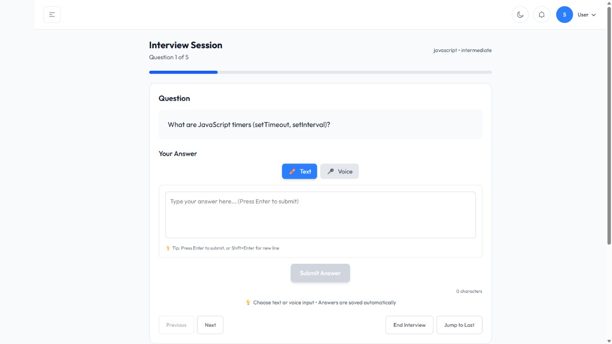
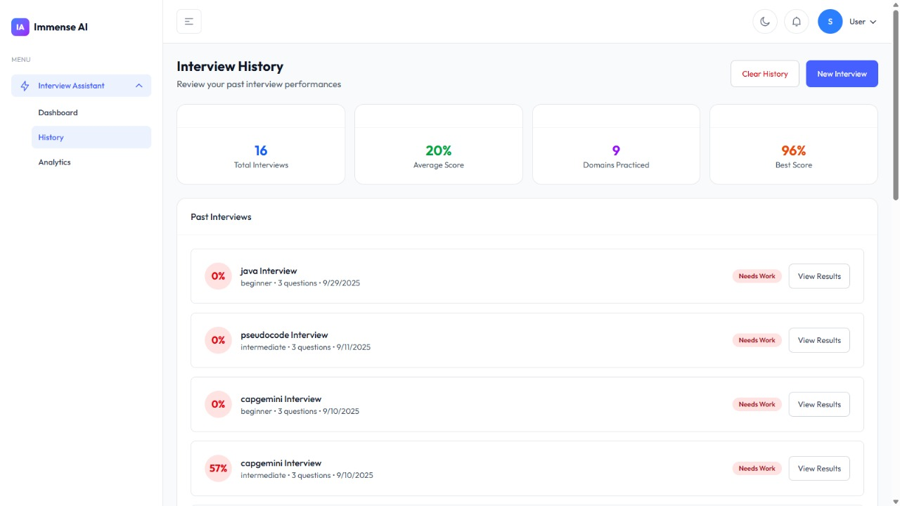

# AI Interview Assistant

The main aim of this project is to develop a full-stack, AI-driven interview preparation tool that simulates real-world technical interviews, evaluates responses using artificial intelligence and helps users enhance their skills through structured insights and progress tracking

## Live Demo

Access the deployed application here:
🔗 https://interview-88de2.web.app/interview

Experience the full workflow including interview simulation, AI-based evaluation, and performance analytics in real-time.

## Features

- **AI-Powered Questions**: Generate technical interview questions using Google Gemini AI
- **Multiple Domains**: Support for JavaScript, Python, React, and more
- **Real-time Analysis**: Get instant feedback on your answers
- **Progress Tracking**: Monitor your interview performance over time
- **Responsive Design**: Works on desktop and mobile devices

## Scope

• Simulating technical interviews across different domains and difficulty levels.
• Enabling users to choose the number of questions based on their practice needs.
• Using Gemini AI to evaluate answers and generate detailed, automated feedback reports.
• Storing and managing user information, responses and reports using Firebase.
• Displaying user progress and performance trends over time.
• Providing a modern, responsive interface built with React and Tailwind CSS for seamless user experience.

## System Architecture



The system architecture follows a modular, service-oriented design. The frontend, built with React and Tailwind CSS, handles user interaction and integrates with the Web Speech API for voice-based input. The backend consists of Python-based services and Firebase Functions that manage application logic and processing. Firebase Authentication is used for secure user management, while Firestore serves as the primary database for storing user data, responses, and reports. External services such as the Gemini API are integrated for AI-driven evaluation and feedback generation. The application is deployed using Firebase Hosting, ensuring scalability and seamless delivery.

### Components



### Sequence Diagram



## User Interface

### Dashboard

Select your domain, difficulty level, and number of questions to customize your interview experience.

### Analytics

Visualize your progress over time with detailed score trends and domain-based performance insights.

### AI-Powered Feedback Report

Receive structured feedback highlighting strengths, weaknesses, and targeted areas for improvement after each session.

### Interview Session

Get a quick snapshot of your interview activity, including total sessions, average score, domains practiced, and best performance.

### Interview History

Track past interviews, review scores, and revisit detailed results to monitor your improvement.

## Project Structure

```
interview_assistant/
├── src/                         # React frontend application
│   ├── components/              # Reusable UI components
│   │   ├── auth/               # Authentication components
│   │   │   ├── ProtectedRoute.tsx
│   │   │   ├── SignInForm.tsx
│   │   │   └── SignUpForm.tsx
│   │   ├── common/             # Shared components
│   │   │   ├── ChartTab.tsx
│   │   │   ├── ComponentCard.tsx
│   │   │   ├── GridShape.tsx
│   │   │   ├── PageBreadCrumb.tsx
│   │   │   ├── PageMeta.tsx
│   │   │   ├── ScrollToTop.tsx
│   │   │   ├── ThemeToggleButton.tsx
│   │   │   └── ThemeTogglerTwo.tsx
│   │   ├── form/               # Form components
│   │   │   ├── input/          # Input components
│   │   │   │   ├── Checkbox.tsx
│   │   │   │   ├── FileInput.tsx
│   │   │   │   ├── InputField.tsx
│   │   │   │   ├── Radio.tsx
│   │   │   │   ├── RadioSm.tsx
│   │   │   │   └── TextArea.tsx
│   │   │   ├── date-picker.tsx
│   │   │   ├── Form.tsx
│   │   │   ├── Label.tsx
│   │   │   ├── MultiSelect.tsx
│   │   │   └── Select.tsx
│   │   ├── header/              # Header components
│   │   │   ├── Header.tsx
│   │   │   ├── NotificationDropdown.tsx
│   │   │   └── UserDropdown.tsx
│   │   ├── interview/          # Interview-specific components
│   │   │   ├── AnswerInput.tsx
│   │   │   └── VoiceRecorder.tsx
│   │   └── ui/                  # Base UI components
│   │       ├── button/
│   │       │   └── Button.tsx
│   │       ├── dropdown/
│   │       │   ├── Dropdown.tsx
│   │       │   └── DropdownItem.tsx
│   │       └── modal/
│   │           └── index.tsx
│   ├── context/                # React context (state management)
│   │   ├── AuthContext.tsx
│   │   ├── InterviewContext.tsx
│   │   ├── SidebarContext.tsx
│   │   └── ThemeContext.tsx
│   ├── hooks/                  # Custom React hooks
│   │   ├── useGoBack.ts
│   │   └── useModal.ts
│   ├── icons/                  # SVG icon library
│   ├── layout/                 # Layout components
│   │   ├── AppHeader.tsx
│   │   ├── AppLayout.tsx
│   │   ├── AppSidebar.tsx
│   │   └── Backdrop.tsx
│   ├── pages/                  # Page components
│   │   ├── About.tsx
│   │   ├── Analytics.tsx
│   │   ├── AuthPages/
│   │   │   ├── AuthPageLayout.tsx
│   │   │   ├── Login.tsx
│   │   │   ├── Register.tsx
│   │   │   ├── SignIn.tsx
│   │   │   └── SignUp.tsx
│   │   ├── Interview/
│   │   │   ├── Dashboard.tsx
│   │   │   ├── History.tsx
│   │   │   ├── Results.tsx
│   │   │   └── Session.tsx
│   │   └── OtherPage/
│   │       └── NotFound.tsx
│   ├── services/               # API service functions
│   │   └── api.ts
│   ├── App.tsx                 # Main App component
│   ├── firebase.ts             # Firebase configuration
│   ├── index.css               # Global styles
│   └── main.tsx                # Application entry point
│
├── backend/                    # Python Flask backend
│   ├── services/              # Business logic services
│   │   ├── ai_service.py      # Gemini AI integration
│   │   └── interview_service.py
│   ├── utils/                 # Utility functions
│   │   └── firebase_utils.py  # Firebase utilities
│   ├── app.py                 # Main Flask application
│   ├── question_bank.py       # Question data
│   ├── requirements.txt       # Python dependencies
│   ├── setup_env.py           # Environment setup script
│   ├── firebase-credentials.json
│   ├── .env                   # Environment variables
│   └── .env.example           # Environment template
│
├── public/                     # Static assets
│   ├── images/
│   │   ├── favicon.ico
│   │   └── logo.png
│   └── favicon.png
│
├── .env                        # Root environment variables
├── .env.example                # Environment template
├── .gitignore                  # Git ignore rules
├── package.json                # Node.js dependencies
├── tsconfig.json              # TypeScript configuration
├── vite.config.ts             # Vite configuration
└── firebase.json              # Firebase configuration
```

## Setup Instructions

### Prerequisites
- Node.js (v18 or higher)
- Python (v3.8 or higher)
- Firebase project with Firestore enabled
- Google Gemini API key

### Backend Setup

1. **Navigate to backend directory:**
   ```bash
   cd backend
   ```

2. **Create virtual environment:**
   ```bash
   python -m venv venv
   venv\Scripts\activate  # On Windows
   source venv/bin/activate  # On Linux/Mac
   ```

3. **Install dependencies:**
   ```bash
   pip install -r requirements.txt
   ```

4. **Set up environment variables:**
   ```bash
   cp .env.example .env
   # Edit .env with your Firebase credentials and Gemini API key
   ```

5. **Run the backend:**
   ```bash
   python app.py
   ```

### Frontend Setup

1. **Navigate to project root:**
   ```bash
   cd interview_assistant
   ```

2. **Install dependencies:**
   ```bash
   npm install
   ```

3. **Set up Firebase configuration:**
   - Create a `.env` file in the root directory
   - Add your Firebase configuration (see below)

4. **Run the development server:**
   ```bash
   npm run dev
   ```

## Firebase Setup

1. **Create a Firebase project** at https://console.firebase.google.com/
2. **Enable Firestore** in your Firebase project
3. **Generate service account credentials** for backend access
4. **Enable Authentication** with Email/Password provider

## Environment Variables

### Backend (.env)
```
FIREBASE_CREDENTIALS_PATH=backend/firebase-credentials.json
GEMINI_API_KEY=your_gemini_api_key_here
FLASK_ENV=development
```

### Frontend (.env)
```
VITE_FIREBASE_API_KEY=your_api_key
VITE_FIREBASE_AUTH_DOMAIN=your_project.firebaseapp.com
VITE_FIREBASE_PROJECT_ID=your_project_id
VITE_FIREBASE_STORAGE_BUCKET=your_project.appspot.com
VITE_FIREBASE_MESSAGING_SENDER_ID=your_sender_id
VITE_FIREBASE_APP_ID=your_app_id
```

## API Endpoints

- `POST /api/interview/start` - Start a new interview
- `GET /api/interview/:id/question` - Get next question
- `POST /api/interview/:id/answer` - Submit answer
- `GET /api/interview/:id/report` - Get analysis report
- `GET /api/interview/history/:userId` - Get interview history

## Development Workflow

1. **Start the backend server** in one terminal
2. **Start the frontend development server** in another terminal
3. **Make changes** to components and see them update in real-time
4. **Test the interview flow** end-to-end

## Building for Production

1. **Build the frontend:**
   ```bash
   npm run build
   ```

2. **Deploy to Firebase Hosting:**
   ```bash
   firebase deploy --only hosting
   ```

## Security Notes

- Never commit `.env` files or Firebase credentials to version control
- The `.gitignore` file is configured to exclude sensitive files
- Always use environment variables for API keys and secrets
- Review `.gitignore` before committing

## Contributing

1. Fork the repository
2. Create a feature branch
3. Make your changes
4. Test thoroughly
5. Submit a pull request

## License

This project is licensed under the MIT License.
